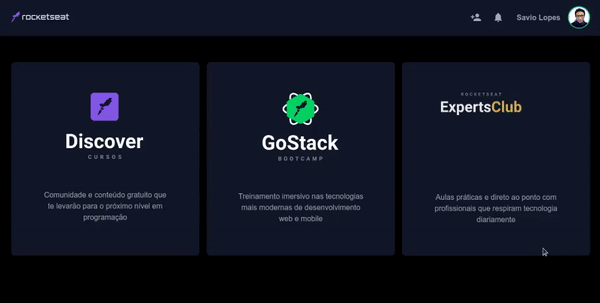

<h3 align="center">
  
</h3>

 💬 <strong>Clone do Dashboard do app da Rocketseat utilizando TailwindCSS</strong> 🚧
 

  
 

   
  
  
 
 

  

## :pushpin: Índice

- [Sobre](#sobre-o-projeto)
- [Layout](#layout)
- [Deploy](#deploy)
- [Tecnologias](#tecnologias)
- [Licença](#licenca)
- [Autor](#autor)
- [Agradecimentos](#agradecimento)

 

## 💻 Sobre o projeto

🚀 A aplicação é consiste em um clone do dashboard do app da Rocketseat utilizando TailwindCSS.

 

💡 Desenvolvido durante o Workshop ministrado pelo dev Mayk Brito, no evento [DoWhile 2020](https://dowhile.rocketseat.com.br).

 

## ⚡ Deploy

🎲 Segue abaixo o link do Deploy da Aplicação
  
🔗 [Deploy da Aplicação](https://savio-2-lopes.github.io/Clone-Dashboard-TailwindCSS/).

 

## 🎨 Layout

  

 

## 🛠 Tecnologias

As seguintes ferramentas foram usadas na construção do projeto:

- [TailwindCSS](https://tailwindcss.com/)

 

## :memo: Licença

Todos os direitos reservados a [Rocketseat](https://rocketseat.com.br/)

 

Este projeto está sob a licença do MIT. Veja a [página de licença](https://opensource.org/licenses/MIT) para mais detalhes.

 

## 🦸 Autor

 
 
 
 

Feito com ❤️ por Savio Lopes 👋🏽 [Entre em contato!](https://www.linkedin.com/in/savio-lopes/)

 

## 💙 Agradecimentos

Obrigado [Rocketseat](https://rocketseat.com.br/) por disponibilizar esse conteúdo sensacional 🚀.
